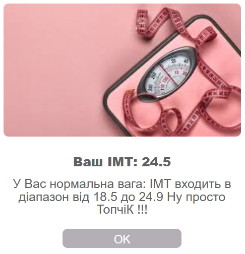

     ## 🏋️‍♂️ BMI Calculator  

<p align="center">
  
 
</p>


This is a **React** application for calculating the **Body Mass Index (BMI)**.  
The project allows users to input their height and weight to compute their BMI and provides an indication of their weight category based on the calculated value.
🔗 Live Demo:([https://alexsand-r.github.io/imt/](https://alexsand-r.github.io/index-IMT/))

## 🚀 Features  

✅ **Input Form**: Enter your height and weight.  
✅ **BMI Calculation**: Computes the BMI based on the input values.  
✅ **Weight Categories**: Displays the weight category based on the BMI result.  

## 🛠️ Technologies Used  

 **React** – For building the user interface.  
- 🎨 **CSS** – For styling the application.  
- 🌍 **GitHub Pages** – For hosting the application.  

## 📥 Installation  

To get started with this project locally, follow these steps:  

1. **Clone the Repository**  

   ```bash
   git clone https://github.com/alexsand-r/index-MT-react.git

## 📊 BMI Categories  

| BMI Range      | Category       |
|---------------|---------------|
| < 18.5        | Underweight    |
| 18.5 - 24.9   | Normal weight  |
| 25 - 29.9     | Overweight     |
| ≥ 30          | Obese          |

💡 Feel free to explore the project and contribute! 🚀

📫 Contact Me: 1inboxna@gmail.com
